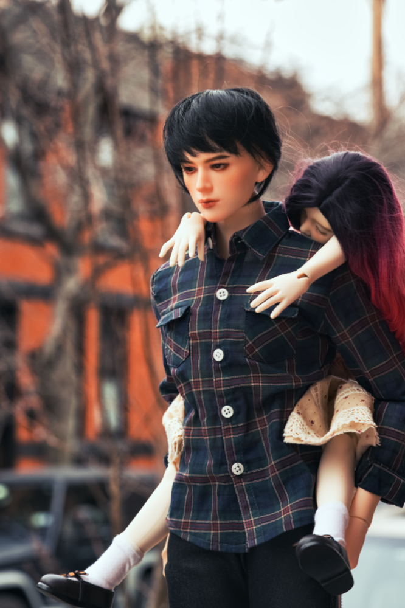

<figure><figcaption>Adeon Zhou - January 2023</figcaption></figure> 

| Character Profile | |
| ----- | ---|
| **Age** | 28 |
| **Birthday** | Februrary 04 |
| **Gender** | Male |
| **Occupation** | Development League Basketball Player |
| **Spouse** | [Noema Wen](../neoma/) (divorced) |
| **Children** | [Saffron Zhou](../saffron/) |
| **Parents** | Hester Zhou (mother) |

---

| Doll Profile | |
| ----- | ---|
| **Maker** | Pygmalion Dolls |
| **Head Sculpt** | Eita |
| **Resin Color** | White |
| **Body** | Pygmalion Dolls TEIA 71  White |
| **Face-up artist** | DollFaced Studio |
| **Date of acquisition** | February 2021 |
| **Provenance** | Purchased second-hand on Den of Angels |
| **Eyes** | TianBa0830   Resin   Golden Brown (Winter 2021 - No. 01)   10/5 |
| **Wig** | Iplehouse   IHW_M082   Fiber   Black   9-10" |