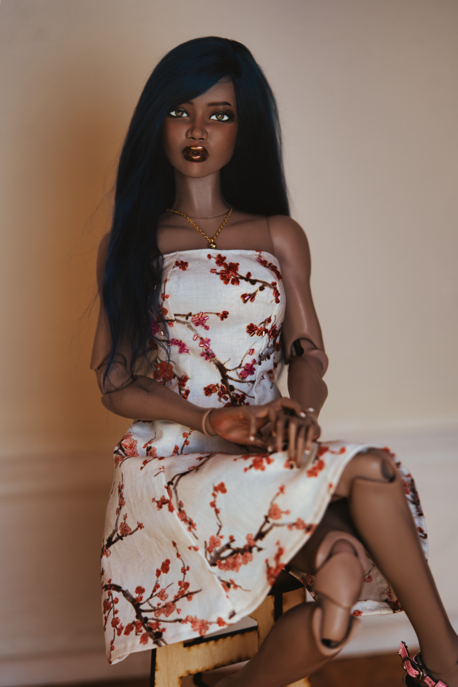

  
<figure><figcaption>Adja Binti - September 2023</figcaption></figure> 

  

| Character Profile | |
| ----- | ---|
| **Age** | 23 |
| **Birthday** | September 22 |
| **Gender** | Female |
| **Occupation** | Project Manager |

---

| Doll Profile | |
| ----- | ---|
| **Maker** | [Draugar Dolls](https://draugardolls.com/) |
| **Head Sculpt** | [Selene](https://draugardolls.com/selene/) |
| **Resin Color** | Mabon |
| **Body** | [Draguar Dolls Hunter](https://draugardolls.com/preorders-hg/)  Mabon |
| **Face-up Artist** | [Dannis Designer Dolls](https://www.instagram.com/dannisdesignerdolls/) |
| **Body Blushing Artist** | [Dannis Designer Dolls](https://www.instagram.com/dannisdesignerdolls/) - Hands|
| **Date of Acquisition** | September 2023 |
| **Provenance** | Purchased directly from Draugar Dolls |
| **Eyes** | [AshuraDarkEyes](https://www.etsy.com/shop/ashuradarkeyes)   Resin   Green+Brown   12/5 |
| **Wig** | [Milklegsdolls](https://www.instagram.com/milklegsdolls/)   Custom   Alpaca Fiber   Midnight Blue   17.8cm  |

  

