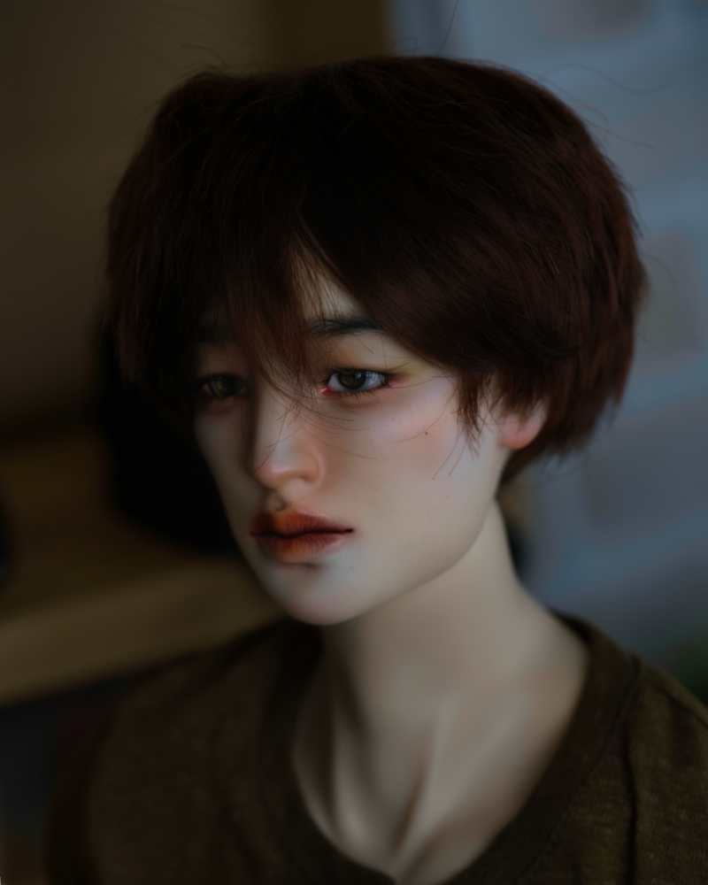

<figure><figcaption>Glaive Wen - March 2023</figcaption></figure> 

| Character Profile | |
| ----- | ---|
| **Age** | 24 |
| **Birthday** | April 16 |
| **Gender** | Male |
| **Occupation** | Unemployed |
| **Relatives** | [Neoma Wen]() (sister)   [Saffron Zhou]() (niece)|

---

| Doll Profile | |
| ----- | ---|
| **Maker** | Meeks Doll |
| **Head Sculpt** | Farrell |
| **Resin Color** | Buff |
| **Body** | Meeks Doll Labellas   Buff |
| **Face-up artist** | Komorebi Dolls |
| **Body blushing artist** | Komorebi Dolls - Hands |
| **Date of acquisition** | April 2022 |
| **Provenance** | Purchased directly from Meeks Doll |
| **Eyes** | TianBa0830   Resin   Green Brown (summer 2022 - No. 07)   14/5 |
| **Wig** | LeekeWorld   "Mark"   Fiber   Brown   8-9" |