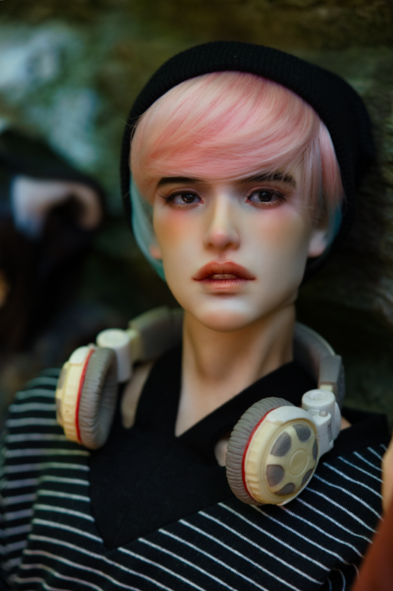

  
<figure><figcaption>Seacan - May 2023</figcaption></figure>

  

| Character Profile | |
| ----- | ---|
| **Age** | 26 |
| **Birthday** | August 10 |
| **Gender** | Male |
| **Occupation** | Voice Actor |

---

| Doll Profile | |
| ----- | ---|
| **Maker** | [Rugged Realism](https://ruggedrealism.wordpress.com/) |
| **Head Sculpt** | [Epsilon](https://ruggedrealism.wordpress.com/2019/05/21/epsilon/) |
| **Resin Color** | Truly Divine |
| **Body** | [Rugged Realism Alphabets](https://ruggedrealism.wordpress.com/2019/05/22/about-the-alphabet-series/)   Truly Divine |
| **Face-up Artist** | [Komorebi Dolls](https://komorebidolls.com/) |
| **Body Blushing Artist** | Unknown |
| **Date of Acquisition** | Body - May 2022   Head - August 2022 |
| **Provenance** | Purchased second-hand on [Den of Angels](https://denofangels.com/) |
| **Eyes** | [AshuraDarkEyes](https://www.etsy.com/shop/ashuradarkeyes)   Resin   Brown   14/5 |
| **Wig** | [Luts](https://eluts.com/)   [DW 277](https://eluts.com/product/dw-227-pinkblue/187/?cate_no=166&display_group=1)   Heat Resistant Fiber   Pink/Blue   9-10" |

  

