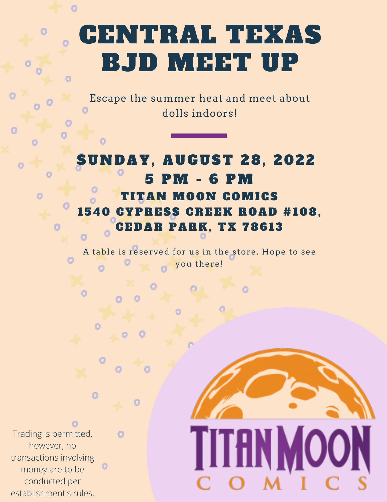

One of the goals that I had set out at the beginning of 2023 was to meet new people. We moved out of Texas right before the start of winter, so going out to meeting people then was a little more onerous, but with spring in full bloom, that is no longer a valid excuse.  I ended up going to a doll meet up in NYC last week where I got to meet other doll collectors in person. It was lovely to be among others who enjoy the hobby and seeing their beautiful dolls in person was certainly a highlight.

I had the fortune or misfortune of starting in the BJD hobby right before the start of the pandemic. Doll meet ups and conventions were regular events in the community, but collapsed when the world went on lockdown. Though forums and social media, I hosted my first doll meet up in Central Texas because there hadn't been one going on that someone else was hosting. I even made a flyer.

It was lovely to meet local Texas doll friends, and we made plans to set up a meet the the future. Little did I know that I would be making a cross country move three months later and living in the East Coast. I messaged one of the doll collectors, [Emac](https://www.instagram.com/emac116/), that I talked with the most to inform them that I was moving and that that future doll meet up would not be hosted by me, and I hoped that it would still continue in some fashion. It turns out they also made the decision to move out of Texas to New York. I jokingly at the time mentioned that maybe we can meet up again in the future at the NYC doll meet up.

Fast forward to April 2023, I saw on their Instagram photos of the NYC doll meet up, and I promptly looked into seeing if I could attend the one in May. NYC is a couple states over, but only 90 minutes by rail, and when I checked the prices on Amtrak, a round trip ticket cost me a whopping $29. At that point, I had little excuse not to attend. The day finally came, and I decided to bring [Rai]() since he was my most put together doll that hasn't really gotten much interaction. Both [Aubert]() and [Seacan]() got to meet [Sorona BJD](https://www.instagram.com/sorona_bjd/)'s boys.

I had so much fun even though I was rather exhausted from fitting in too many social events earlier in the week. I managed to take a few photographs, but mostly I enjoyed meeting new people and catching up with Emac. Afterwards a smaller subset of us went to dinner, and that was great to just get to know each other a little better. 



My June 2023 tickets have already been secured, so I look forward to seeing new and familiar faces. The theme will be "Hot Doll Summer", so I'll need to figure out who to bring and what they will wear. Cheers to having things to look foward to!