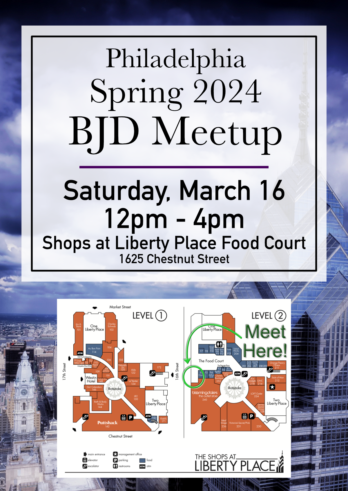

Wow! It's been almost a year since I've written something on this blog. The blog aspect was always a tertiary goal as I wanted to be able to create this page and have my own space where I could control the content that I created. What I can I say, the platforms really do make it easy to publish content, so most of my photos have ended up on Instagram, along with any captions with small updates.

This year, I have been making a greater effort to share more broadly. I grew up as a very private person, and I never published much on Facebook except for some cryptic status updates. But after my kiddo was born, I basically dropped that platform altogether. I just wasn't getting the value out of the way interactions were happening. There was a voyeuristic quality and no real connection. I actually didn't join Instagram fully until I joined the doll hobby and am primarily active as a curator of their lives on my profile.

The Discord servers that I feel comfortable speaking in are where there are small, like less than 10 people, communities. I just have never felt comfortable being in a large group. That environment tends to exacerbate my silence, so having this little space to call my own is probably where I am the most me.

That said, I do value and treasure connections. I have been meeting with doll collectors in person. I went to Resin Rose in 2023, and I have made plans to go again this year. I was going to say that I didn't even make any new connections, but that's not true. I met a few of the people that I only knew online in person. My hope for this year is to meet at least one other person that I will keep up with past the initial meeting at Resin Rose.

I've also purchased my next few NYC train tickets to join the NYC BJD group each month. It's been so nice to have something to look forward too each month. I even created a YouTube video for the December 2023 Meetup. Look at me!



Also, I've restarted my sewing and released my first public pattern on Den of Angels. It was based off of a Sartoria J dress that I really liked, but knew through another collector, would not fit the Impldoll Star Model body. So I tooke it as a challenge to recreate it myself, and I'm fairly happy with the result--enough to share it! It's a small way for me to start giving back to the community, and it also gives me some accountability which is a motivating factor for me. I am definitely going to make sewing a larger part of this year

Now that I've been here in Philly for some time, I'm going to try to host (well co-host) a Philly based doll meetup! And in my typical fashion, I made another flyer, though this one is less snazzy imho.

This year, I'm also putting my foot down on not buying any new dolls. I only have one more incoming, and I'm thinking that this will arrive in the summer. We're only a little over two months into 2024, and I'm hoping that I will stay strong!! I will post more updates to this blog as well. Some small goals!