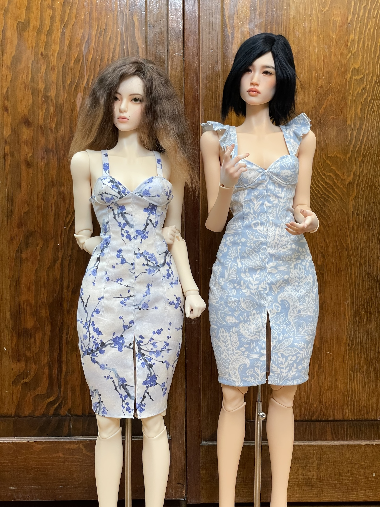

## Patterns
|   |   |
|---|---|
| <figure><figcaption><a href="impldoll-fitted-dress.pdf" target="_blank">Fitted Knee Length Dress with Flounce Sleeves (PDF)</a></figcaption></figure> |

## Measurements

---

I measured my doll as guided by [Pattern Maker Pro](https://patternmakerpro.com/manual/taking-measurements/measuring-a-model). With these measurements, you can generate slopers/blocks as well as other basic patterns. I use many of the patterns available as a starting point and modify as I want changes to fit and style.


Basic


| Measurement Set | Description | Values in Centimeters |
| ----- | --- | --- |
|Across Back|From armpit to armpit across the back at mid-armhole level.|10|
|Across Front|From armpit to armpit across the back at mid-armhole level.|10.2|
|Ankle|Base of the leg just above the ankle bone.|7.5|
|Armhole Length|Length From cervical back to imaginary line at armpit level.|5.5|
|Bicep|Around bicep at the widest point.|8|
|Center Back to Floor|Back to Floor Cervical back to floor.|52|
|Center Back to Waist|Back to Waist Cervical back to natural waistline.|12|
|Chest / Bust|Chest / bust circumference.|29|
|Crotch Rise|Natural waist to chair while sitting.|10|
|Foot|Heel to the end of the longest toe.|7|
|Front Length|Shoulder line to the natural waistline at the bust apex point.|13.5|
|Height|Top of head to floor. Mark a wall and measure down.|63|
|Hip|Hip / seat circumference at widest point.|31|
|Inseam|Crotch to the floor.|33|
|Neck|Around neck base touching front collar bone and cervical bone.|14|
|Overarm Length|Shoulder point to elbow to wrist with slightly bent arm.|20|
|Shoulder Width|Side neck point to shoulder point.|3|
|Trunk|Center of the shoulder line through crotch and up meeting start.|475.|
|Waist - Low|Measure around the body at the level of pants.|23|
|Waist - Natural|Natural waist circumference. Elbow level.|19|
|Waist to Floor|Natural waist to floor at center back.|41|
|Waist to Hip|Natural waist vertical to hip line in back.|6.5|
|Waist to Knee|From back natural waistline to knee.|22|
|Waist to Low Waist|Natural waist line vertically to low waist line.|2.5|
|Wrist|Around the wrist just above the wrist bone.|6|

 


Extended


| Measurement Set | Description | Values in Centimeters |
| ----- | --- | --- |
|Blade Apex Width Back|Blade apex to blade apex in back.|3|
|Blade Height Back|Blade apex to waist in back.|5|
|Bust / Chest Height Front|Bust / Chest to waist at center front.|6|
|Bust / Chest Width Back|Side-to-side at bust/chest level in back.|12.5|
|Bust / Chest Width Front|Side-to-side at bust/chest level in front.|16.5|
|Bust Apex Width Front|Bust apex to bust apex.|6.2|
|Bust Depth|Shoulder point to bust apex.|8.2|
|Bust Radius|Bust apex to underbust.|3|
|Calf|Circumference of the widest part of calf.|10.4|
|Center Length Back|Center back neck to center back waist.|11.5|
|Center Length Front|Center front neck to center front waist.|10.25|
|Crotch Length|Center front waist to center back waist.|22.5|
|Elbow Circumference|Circumference around elbow.|6.5|
|Elbow to Wrist Length|Distance from elbow to wrist.|9.5|
|Full Length Back|Side neck point to waist in back.|12|
|Full Length Front|Side neck point to waist in front.|13.5|
|Hand|Circumference around hand.|7.3|
|Heel Foot Circumference|Circumference around foot|10|
|Hip Depth Back|Waist to hip at center back.|8.5|
|Hip Depth Front|Waist to hip at center front.|7.5|
|Hip Depth Side|Waist to hip at side.|7.5|
|Hip Width Back|Side-to-side at hip level in back.|16|
|Hip Width Front|Side-to-side at hip level in front.|15|
|Knee Circumference|Circumference of the knee.|8.7|
|Knee Height|Floor to knee measurement.|19.5|
|Mid-Armhole Height Back|Mid-armhole point to side waist in back.|9|
|Mid-Armhole Height Front|Mid-armhole point to side waist in front.|8.5|
|Mid-Armhole Width Back|Mid-armhole point to mid-armhole point across the back.|10|
|Mid-Armhole Width Front|Mid-armhole point to mid-armhole point across the front.|10|
|Neck Back|Side neck point to side neck point following back neck.|5.5|
|Neck Front|Side neck point to side neck point following front neck.|6|
|Overbust Height|Bust apex to overbust level.|2.5|
|Overbust Width Back|Side-to-side at overbust level in back.|12.5|
|Overbust Width Front|Overbust Width Front Side-to-side at overbust level in front.|13.5|
|Shoulder Across Back|Shoulder point to shoulder point in back.|10.8|
|Shoulder Across Front|Shoulder point to shoulder point in front.|10.8|
|Shoulder Slope Back|Shoulder point to center back waist point.|13|
|Shoulder Slope Front|Shoulder point to center front waist point.|14.3|
|Shoulder to Mid-Armhole Back|Shoulder point to mid-armhole point in back.|3|
|Shoulder to Mid-Armhole Front|Shoulder point to mid-armhole point in front.|3|
|Side Leg Length|Side waist point to the floor.|41.5|
|Side Length|Armpit to side waist point.|7|
|Side Waist Depth Back|Side waist point to center back neck point.|13.3|
|Side Waist Depth Front|Side waist point to center front neck point.|12.5|
|Strap Front|Side neck point to armpit point.|6|
|Thigh Circumference|Circumference of the upper thigh.|17.5|
|Thigh Height|Floor to thigh measurement.|31|
|Underarm Length|Armpit point to wrist.|16|
|Underbust Height|Underbust level to side waist point.|3.5|
|Underbust Width Back|Back Side-to-side under bust in back.|11.5|
|Underbust Width Front|Side-to-side under bust in front.|12.5|
|Waist Width Back|Side-to-side at waist level in back.|9|
|Waist Width Front|Side-to-side at waist level in front.|10|

