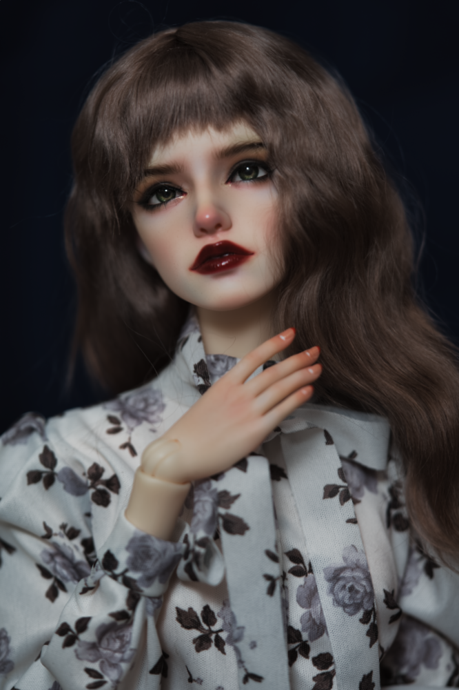
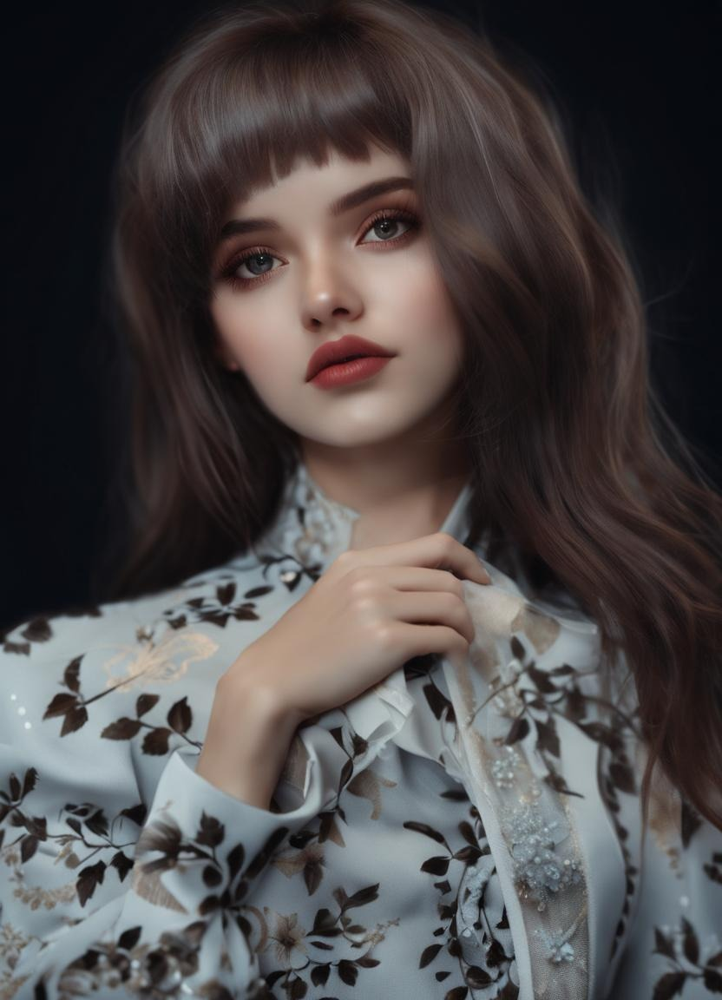

AI has been making waves in the creative world in the second half of 2022. I haven't had a chance to really experiment because it was just not easily accessible. However in late 2023, there are more options to run inference models locally and for free.

So here is a small but growing collection of my dolls that I've edited using Stable Diffusion XL to make them look more human.

| Original | AI Edit |
| ----- | ---|
|  ||
|  ||
|  ||
|  ||