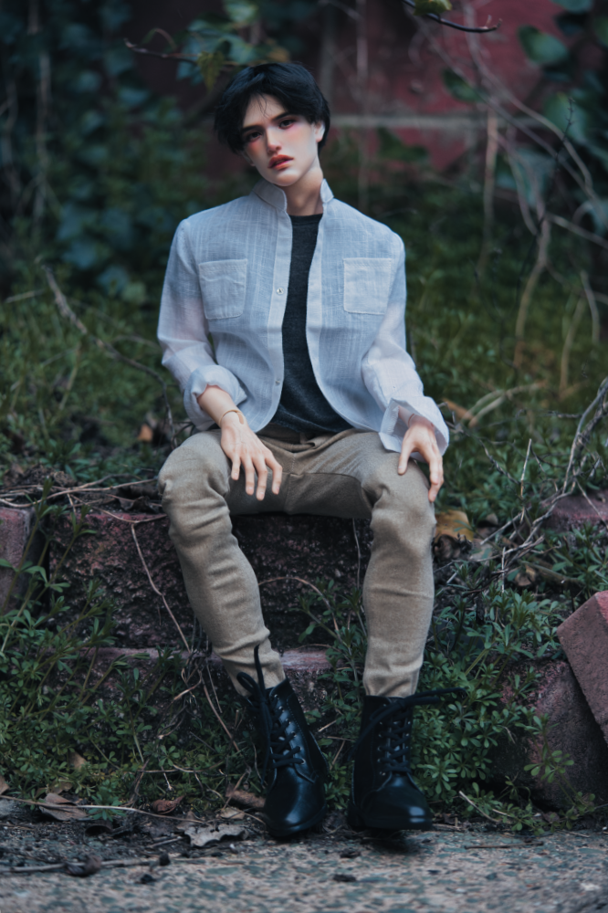
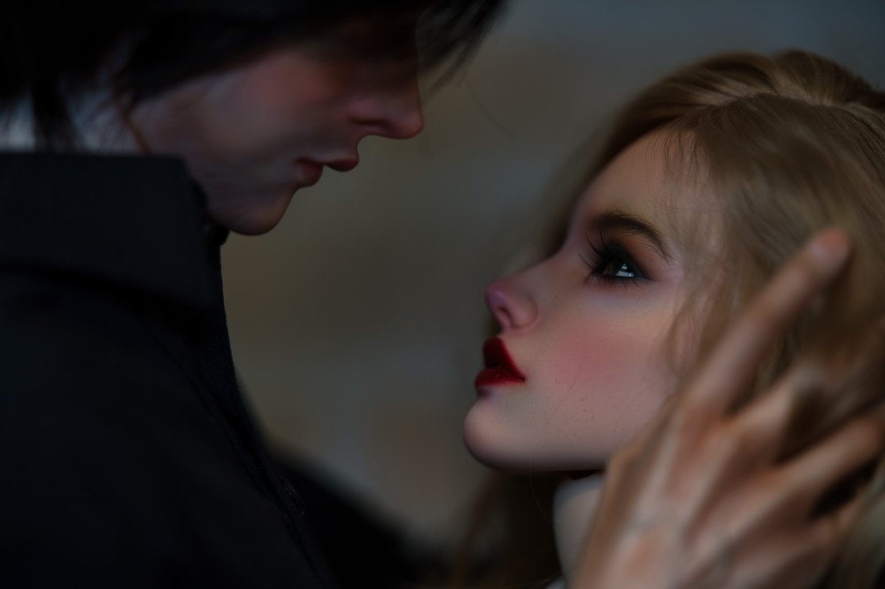

One of my favorite parts of the doll hobby is the how it is a gateway to other hobbies. While there are many collectors that do every part of the customization of their dolls, I have chosen to specialize in sewing and photography. There is just something so satistifying on recreating scenes or moments using dolls as the talent.

Below are a selection of some of my favorites. I hope one day to get enough so that I can create a coffee table book filled with photos I've taken and edited.


  
  
  
  
  
  
  

